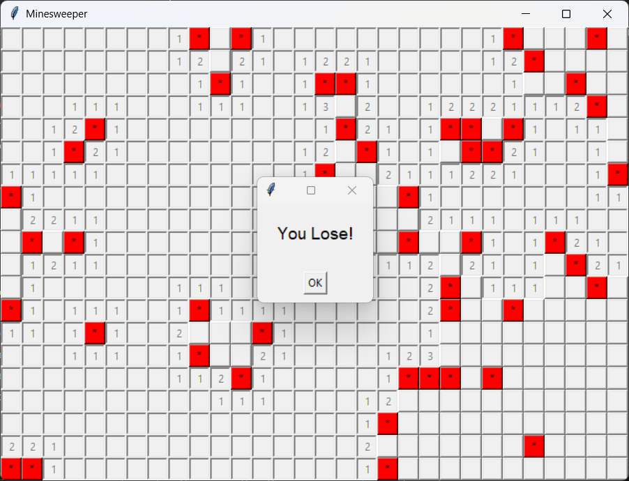

# 🧨 Minesweeper Game

A simple yet functional **Minesweeper** clone built with Python's Tkinter library. Customize your grid size and mine count, then test your logic and luck to uncover all the safe cells!

## 🖼️ Preview



## 🎮 Features

- Dynamic board size (configurable rows, columns, and number of mines)
- Randomized mine placement
- Flood-fill reveal for empty regions
- Victory and loss detection with popup messages
- Simple, responsive interface using `tkinter`

## 🚀 Getting Started

### Requirements

- Python 3.x (tested on 3.11)
- No external libraries required (uses only standard Python modules)

### How to Run

Clone the repository and run the script:

```bash
git clone https://github.com/MihMihai13/Minesweeper.git
cd Minesweeper
python minesweeper.py
```

### Game Setup
- Upon launching, you'll be prompted to configure the game:
- Rows: number of rows in the grid
- Columns: number of columns in the grid
- Mines: total number of hidden mines

⚠️ Validation prevents you from creating a board too large for your screen or with too many mines.
